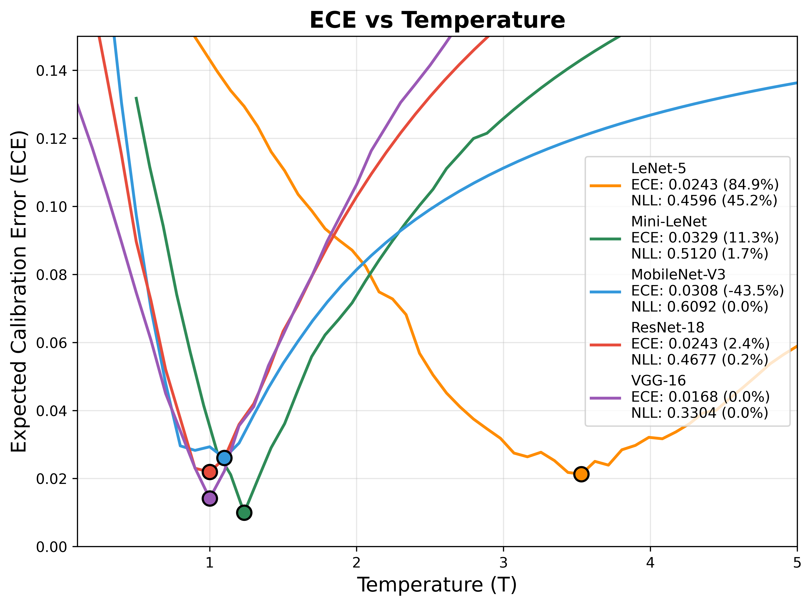

# CNN Calibration: Understanding Confidence in Neural Networks

[](https://www.python.org/downloads/)
[](https://pytorch.org/)
[](LICENSE)

**Authors:** María Muñoz Pérez, Isabel Carballo Rueda,MohammadErfan Jabbari
**Course:** Deep Learning - CNN  
**Date:** October 2025

---

## 🎯 Overview

This project investigates **calibration** in Convolutional Neural Networks (CNNs), addressing a critical question: _Do neural networks' confidence scores accurately reflect their true accuracy?_

While modern CNNs achieve impressive accuracy, they often produce **overconfident predictions** that don't align with empirical performance. This miscalibration poses significant risks in safety-critical applications like medical diagnosis and autonomous driving.

### What is Calibration?

A perfectly calibrated model predicting 80% confidence should be correct 80% of the time. We measure this using:

- **Expected Calibration Error (ECE)**: Quantifies the gap between confidence and accuracy
- **Reliability Diagrams**: Visualize calibration quality
- **Temperature Scaling**: Post-hoc method to improve calibration without retraining

### Research Questions

1. How does model capacity affect calibration with limited data?
2. Can temperature scaling restore reliability without hurting accuracy?
3. Do pre-trained models exhibit better calibration than models trained from scratch?

---

## 📁 Project Structure

```
CNN-Calibration/
├── README.md                          # This file
├── CNN_Calibration_Project.ipynb      # Main Jupyter notebook with full implementation
├── CNN_Calibration_Project.html       # HTML export of notebook
│
├── project_report.tex                 # LaTeX source for academic report
├── project_report.pdf                 # Compiled 3-page report
├── references.bib                     # Bibliography
│
├── images/                            # Visualization outputs
│   ├── reliability_diagrams.png       # Calibration visualizations (before/after)
│   ├── temp_scaling_ece.png          # ECE vs temperature curves
│   └── temp_scaling_nll.png          # NLL vs temperature curves
│
├── data/                              # CIFAR-10 dataset (auto-downloaded)
│   └── cifar-10-batches-py/
│
├── .gitignore                         # Git ignore rules
└── requirements.txt                   # Python dependencies
```

---

## 🔬 Methodology

### Dataset

- **Source**: CIFAR-10 (birds vs cats binary classification)
- **Classes**: Bird (class 2) → 0, Cat (class 3) → 1
- **Split**: 8,000 train / 2,000 validation / 2,000 test
- **Preprocessing**: Normalized to [-1, 1]

### Models

#### 1. LeNet-5 (61,326 parameters)

- Classic architecture: 2 conv layers (6, 16 filters) + 3 FC layers
- Trained from scratch for 20 epochs
- Adam optimizer (lr=0.001)

#### 2. Mini-LeNet (4,048 parameters)

- Reduced variant: 2 conv layers (2, 4 filters) + 3 FC layers
- 93.4% fewer parameters than LeNet-5
- Same training configuration

#### 3. Pre-trained Models

- **MobileNet-V3-Small** (1.5M params, 2K trainable)
- **ResNet-18** (11.2M params, 1K trainable)
- **VGG-16** (134.3M params, 8K trainable)
- Fine-tuned for 80 epochs with frozen features

### Calibration Metrics

**Expected Calibration Error (ECE)**:

```
ECE = Σ (|B_m|/n) × |acc(B_m) - conf(B_m)|
```

- Partitions predictions into M=15 bins by confidence
- Measures weighted average gap between accuracy and confidence
- Lower is better (0 = perfect calibration)

**Temperature Scaling**:

```
p_i = exp(z_i/T) / Σ exp(z_j/T)
```

- T > 1: softer predictions (less confident)
- T < 1: sharper predictions (more confident)
- Optimal T minimizes NLL on validation set

---

## 📊 Results

### Reliability Diagrams


**Before Calibration (Top Row)**:

- LeNet-5 shows severe overconfidence (bars far from diagonal)
- Predictions cluster in high-confidence bins despite lower accuracy
- Mini-LeNet exhibits mild overconfidence

**After Temperature Scaling (Bottom Row)**:

- LeNet-5 bars align with diagonal (T=3.71)
- Confidence scores now reliably reflect true accuracy
- Mini-LeNet requires minimal adjustment (T=1.23)

### Temperature Optimization

<p align="center">
  
</p>

- **LeNet-5**: U-shaped curve bottoms at T=3.71 (severe initial overconfidence)
- **Mini-LeNet**: Optimal near T=1.2 (already reasonably calibrated)
- **Transfer models**: Minimal adjustment needed (T ≈ 1.0-1.1)

### Model Comparison

| Metric                  | LeNet-5 | Mini-LeNet | VGG-16 |
| ----------------------- | ------- | ---------- | ------ |
| **Generalization Gap**  | 17.7%   | 4.3%       | 0.9%   |
| **Baseline ECE**        | 0.1614  | 0.0371     | 0.0168 |
| **Calibrated ECE**      | 0.0243  | 0.0329     | 0.0168 |
| **Optimal Temperature** | 3.71    | 1.23       | 1.00   |

**Key Takeaways**:

1. Excessive capacity → overfitting → miscalibration
2. Temperature scaling repairs overconfidence effectively
3. Pre-trained features provide better calibration than random initialization

---

## 📚 References

1. **Guo, C., Pleiss, G., Sun, Y., & Weinberger, K. Q.** (2017). _On Calibration of Modern Neural Networks_. ICML 2017. [Paper](http://proceedings.mlr.press/v70/guo17a.html)

2. **Platt, J.** (1999). _Probabilistic Outputs for Support Vector Machines_. Advances in Large Margin Classifiers.

3. **LeCun, Y., Bottou, L., Bengio, Y., & Haffner, P.** (1998). _Gradient-based learning applied to document recognition_. Proceedings of the IEEE.

4. **Krizhevsky, A.** (2009). _Learning Multiple Layers of Features from Tiny Images_. Technical Report.

5. **He, K., Zhang, X., Ren, S., & Sun, J.** (2016). _Deep Residual Learning for Image Recognition_. CVPR 2016.

6. **Simonyan, K., & Zisserman, A.** (2014). _Very Deep Convolutional Networks for Large-Scale Image Recognition_. ICLR 2015.

---

## 🔗 Additional Resources

- [Full Project Report (PDF)](project_report.pdf)
- [Original Paper: Guo et al. 2017](http://proceedings.mlr.press/v70/guo17a.html)

---

## 📝 License

This project is licensed under the MIT License - see the [LICENSE](LICENSE) file for details.
